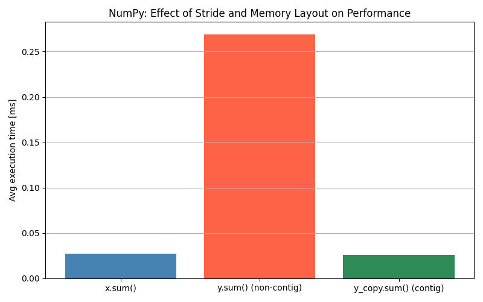

<!-- _class: lead -->

# NumPy におけるメモリ配置とストライドが計算性能に与える影響

- 発表者: 清水悠介 B3
- 所属: 塩本研究室
- 日付: 2025/07/03

---

<!-- _header: 背景と目的 -->

<!-- _header: 背景と目的 -->

## 概要

- 第 1 章はツールの使い方が中心で既知の内容が多く、物足りなさを感じた
- そこで NumPy の「速さの本質」を知るために、内部構造や仕組みに注目
- 今回の目的：

  - ビューとコピーの速度差を実証
  - ストライドとメモリ配置が実行性能に与える影響を理解

- 本スライドのコード・実験結果は以下のリポジトリで管理  
  🔗 [maton369/DL_From_Zero](https://github.com/maton369/DL_From_Zero)

---

<!-- _header: ndarrayの仕組み -->

## ndarray の構造とストライド

- NumPy の `ndarray` は **多次元配列を 1 次元のメモリ領域** に格納している
- 主な属性：
  - `shape`: 各軸の要素数
  - `dtype`: 要素の型（例：float64）
  - `strides`: 各軸を 1 つ進めたときの**バイト数**

```python
a = np.array([[1, 2, 3], [4, 5, 6]])
print(a.strides)  # → (24, 8)  # 行方向, 列方向のバイト幅
```

---

<!-- _header: 仮説：配置と速度の関係 -->

## メモリ配置が速度に与える影響とは？

- NumPy の配列は 1 次元のメモリに格納されており、**ストライド**により多次元アクセスを実現
- この配置（連続か非連続か）によって、**CPU のキャッシュ効率が変化**

## 仮説

**非連続ビューは CPU キャッシュ効率を悪化させ、処理が遅くなる**

> 配列要素が **隣接したメモリアドレスに格納されているかどうか** が性能を左右する。

---

<!-- _header: 実験設定 -->

## 実験設定

```python
# Row-major (C order) vs Column-major (F order) の strides 比較
a = np.random.randn(100, 100)
b = np.array(a, order="C")  # Row-major
c = np.array(a, order="F")  # Column-major
print("b.strides:", b.strides)  # -> (800, 8)
print("c.strides:", c.strides)  # -> (8, 800)

# ストライドによるパフォーマンス差を調べる実験対象
x = np.ones((100_000,), dtype=np.float64)               # contiguous (8,)
y = np.ones((100_000 * 100,), dtype=np.float64)[::100]  # non-contiguous (800,)
y_copy = np.copy(y) # (8,)
```

---

<!-- _header: ベンチマーク結果 -->

## ストライド比較とベンチマーク

| 配列名 | strides | 処理時間（平均） |
| ------ | ------- | ---------------- |
| x      | (8,)    | 0.027 ms         |
| y      | (800,)  | 0.269 ms         |
| y_copy | (8,)    | 0.026 ms         |

---

<!-- _header: 可視化 -->

## グラフによる可視化



---

<!-- _header: 考察 -->

## 考察

- **非連続配列はキャッシュ効率が悪く遅い**
- **連続配列はプリフェッチや SIMD が効いて速い**
- **コピーはメモリを連続化するため速くなる**

---

<!-- _header: 結論 -->

## まとめ

- NumPy の性能は**メモリ配置とストライドに強く依存**
- **非連続ビューは遅く、copy による連続化が有効**
- パフォーマンスが重要な処理では `.copy()` や `ascontiguousarray()` を明示的に使うべき
- データ構造設計段階から配列アクセスの順序性を考慮すべき

---

<!-- _header: 具体例：データ構造設計 -->

<style scoped>
section {
  font-size: 2.0em;
}
</style>

## データ構造設計の具体例

- **画像処理**  
  → OpenCV や TensorFlow：`(H, W, C)`（高さ・幅・チャネル）  
  → PyTorch：`(C, H, W)`（チャネル優先）で格納  
  → 最初から `C` を先頭に持たせると変換不要で高速

- **行列計算**  
  → `.T`（転置）は非連続ビューになる  
  → 転置前提の計算では最初から shape を工夫して連続にする

- **時系列データ処理**  
  → `(time_steps, features)` の形が多い  
  → 主に `axis=0` に沿ってループするなら `order='F'`（列優先）にすると高速

---

<!-- _header: 引用 -->

## 参考資料

- Zenn 記事：[NumPy の多次元配列データ構造 ndarray の基礎](https://deepage.net/features/numpy-ndarray.html?utm_source=chatgpt.com)
